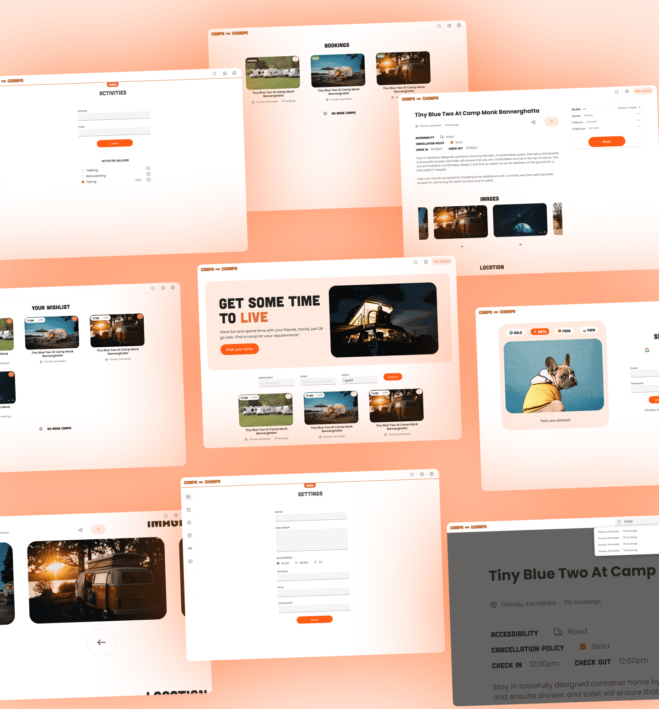

# camps-for-champs frontend

Camps for Champs is a web application that allows the owner to publish camps & users can add them to their wishlist & book them.

The front-end is built using NextJS, Chakra UI, Zustand, & React Query.

## License

[MIT](./LICENSE)
